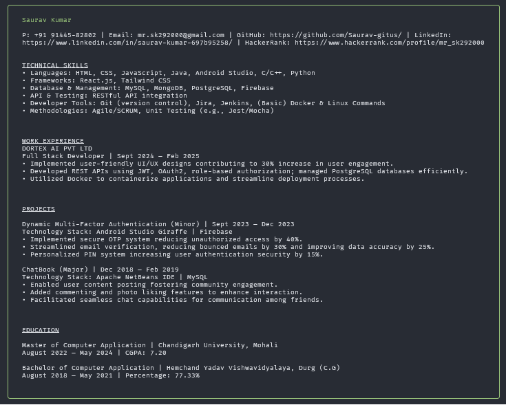

# @saurav-kumar-697b95258/resume

[](https://www.npmjs.com/package/@saurav-kumar-697b95258/resume)
[](https://opensource.org/licenses/MIT)
[](https://github.com/saurav-kumar-697b95258/resume-cli/actions)

> A personal resume CLI tool for **Saurav Kumar** — view my professional resume directly in your terminal using `npx`.

---

## About

This CLI tool allows you to instantly view my professional resume in your terminal with beautiful styling and formatting.  
It uses [chalk](https://www.npmjs.com/package/chalk) for colors and [boxen](https://www.npmjs.com/package/boxen) to create a neat box around the content.

---

## Demo



---

## Installation

No installation required, just run with npx:

```bash
npx @saurav-kumar-697b95258/resume
```
